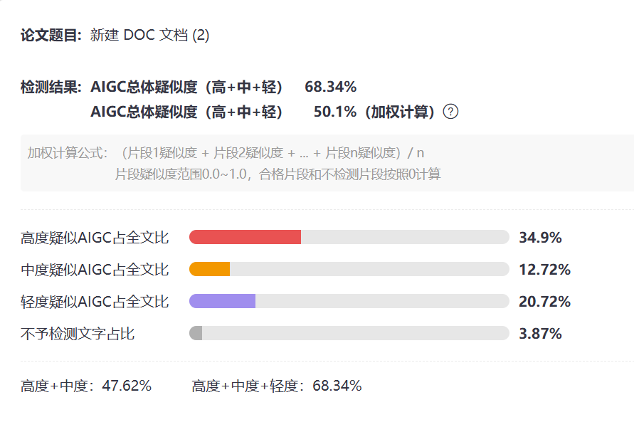
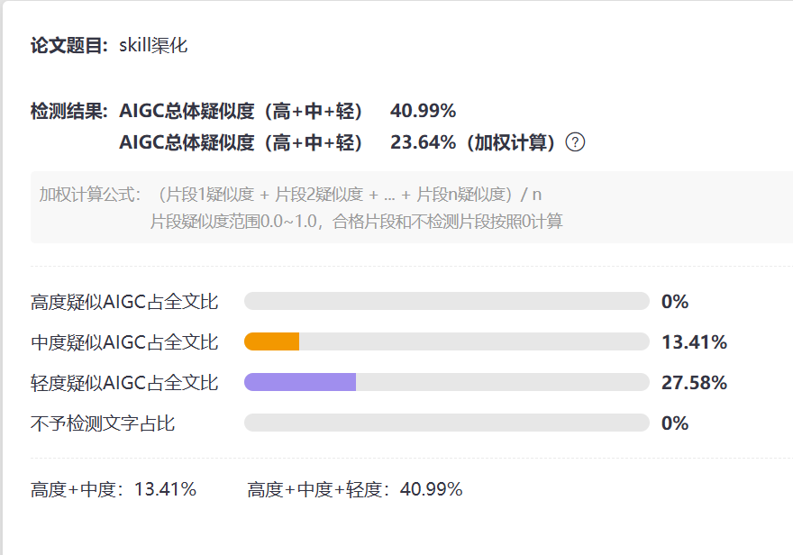
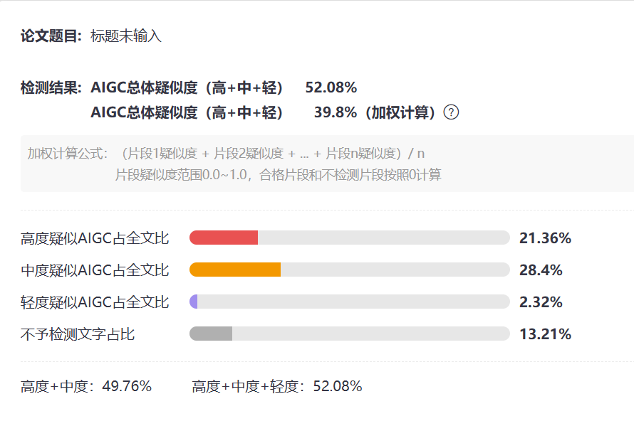
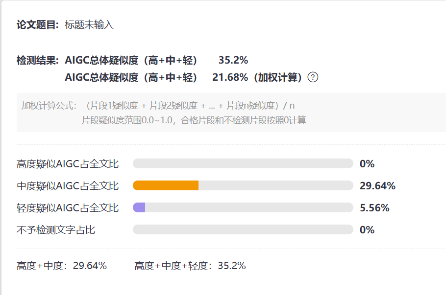
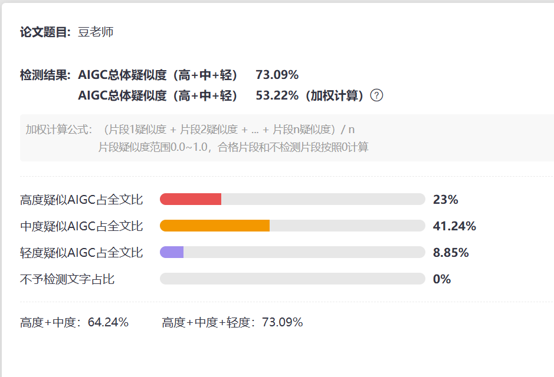
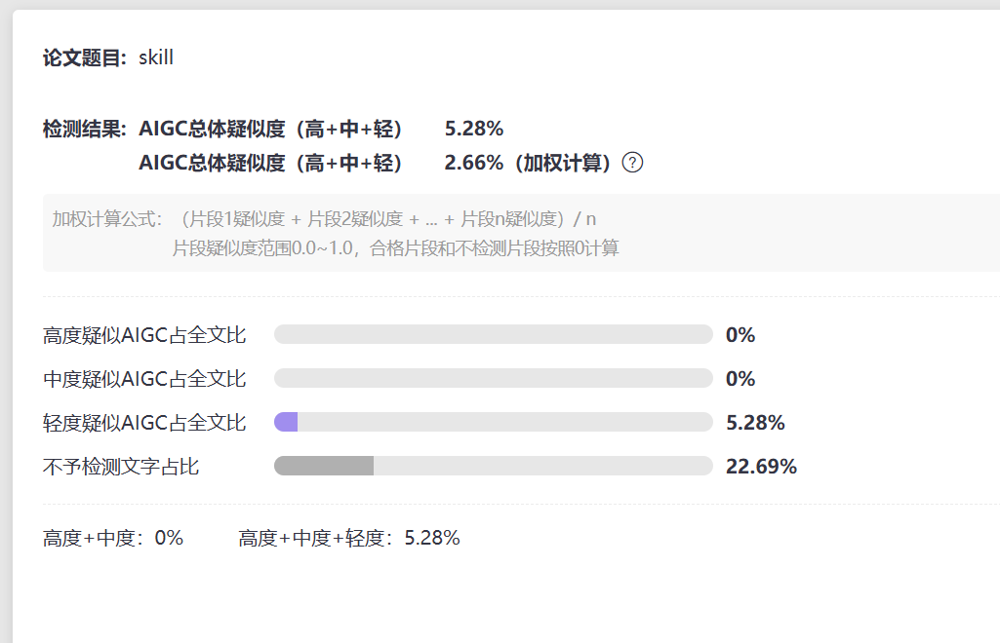

# 去AI味 · 中文版

去除中文写作中可预见的 AI 语病。基于 2025–2026 年最新学术研究，采用三层检测 + 五步工作流，系统识别和消除 AI 写作痕迹。


---

## 触发关键词

在 OpenCode 中说这些词会自动激活此 skill：

**中文写作、润稿、审阅内容、去AI味、中文AI检测、降低aigc率、aigc率、查重、去AI、降AI率**

也可以手动加载：`skill(name="de-aigc-ch")`

---

## 结构

```
de-aigc-ch/
├── SKILL.md                  # 三层检测 + 五步工作流 + 20 条核心规则 + 评分体系
├── README.md
├── references/
│   ├── academic.md           # 学术依据（18 条引用，含论文全称/期刊/关键数据）
│   ├── phrases.md            # 必须删除的词句（废话开场句/黑话/万能句式……）
│   ├── structures.md         # 必须避免的句式结构（排比病/总结癖/长定语/冒号列表……）
│   └── examples.md           # 20 组改前/改后对比
└── scripts/
    └── detect.py             # Python 自动扫描脚本（11 类模式匹配 + 严重度评级）
```

---

## AI 模板长什么样

```
在这个快速发展的时代，[话题]不仅发挥着越来越重要的作用，
更是扮演着不可或缺的角色。值得注意的是，[话题]不仅……而且……
甚至……。综上所述，[话题]具有深远的意义。
```

**关键数据：** 冒号/破折号密度是人类的 2.7–3.2 倍，句长方差只有 1/3，"不只是……更是……"频率是 3.7 倍。

---

## 改造示例

| 阶段 | 文本 |
|---|---|
| **改前** | 在这个科技飞速发展的时代，人工智能不只是在改变我们的生活方式，更是在重塑整个产业格局。值得注意的是，AI 技术在医疗、教育、金融等领域都发挥着越来越重要的作用。研究表明，到 2027 年 AI 将取代大量传统工作岗位，同时也将创造众多新的就业机会。综上所述，AI 技术是一把双刃剑，需要我们审慎对待。 |
| **改后** | AI 正在改变生活，也在重塑产业。医疗、教育、金融——这三个领域已经看到了具体变化。普华永道 2025 年报告预测：到 2027 年，AI 会取代一些岗位——主要是重复性工作——同时也会创造新的职位；历史上每一次技术革命都是这样的。 |

改动：砍废话开场 → 杀"不只是…更是…" → 去泛化引用 → 删"综上所述" → 制造句长方差 → 杀显性连接词 → 绝对改谨慎 → 注入视角

---

## 效果展示

以下三组截图来自 AIGC 检测工具的实际检测结果。原始文本均被检测出较高的 AI 疑似度，使用本 skill 改写后比例显著下降。

### 案例一

| 改前 | 改后 |
|---|---|
|  |  |

### 案例二

| 改前 | 改后 |
|---|---|
|  |  |

### 案例三

| 改前 | 改后 |
|---|---|
|  |  |

---

## 三层检测

| 层级 | 看什么 | 典型问题 |
|---|---|---|
| **词汇层** | 用什么词 | 废话开场、万能句式、"不只是…更是…"、职场黑话、四字堆砌、泛化引用 |
| **句法层** | 句子怎么搭 | 冒号滥用、破折号泛滥、排比堆砌、长定语、转折泛滥、总结癖 |
| **语篇层** | 篇章怎么组织 | 句长方差低（<120）、段落均匀、结论回音壁、显性连接词串联 |

---

## 五步工作流

```
扫描定位 → 诊断分类 → 差异化改写 → 五维自评 → 二次复查
```

**五项改写原则：**
1. **杀寄生虫** — "不只是A更是B" → "A，也是B"
2. **制造句长方差** — 每 200 字必有 ≤12 字短句，最长/最短比值 ≥4
3. **消灭结构标点** — 冒号和破折号每次出现问自己：不用能不能通？
4. **杀显性连接词** — "此外/因此/然而" → 语义接力
5. **绝对→谨慎** — "证明了" → "支持了"，"必然" → "很可能"

---

## 评分体系（六维加权）

| 维度 | 权重 | 关键标准 |
|---|---|---|
| 直接性 | 1.5× | 有具体数据还是通篇铺垫？ |
| 节奏性 | 1.2× | 句长方差 > 120 为佳 |
| 谨慎性 | 1.3× | 有"可能"等谨慎表述？ |
| 隐衔接 | 1.0× | 概念接力还是连词硬连？ |
| 标点自然度 | 1.0× | 冒号 > 1.5/百字 或 em-dash > 3/千字 ≤4 分 |
| 真实性 | 1.0× | 有"我/我们/你"吗？ |

**总分 ≥ 50 通过**，40–49 待改进，< 35 返回重写。

---

## 快速检查清单

**词汇层：** 删"值得注意的是/不可否认的是" → 杀"不只是…更是…" → 去"赋能/闭环/抓手" → 砍万能句式 → 补具体数字替代"大量/众多" → 泛化引用无来源则删

**句法层：** 剁连续四字成语（留一个） → 删"综上所述" → 一段冒号不超过两次 → em-dash 全文不超过两次 → "的"超两个就拆句 → 被动语态改主动

**语篇层：** 连续 5 句长度差 ≤8 字就打破 → 最长/最短比值 < 4 则调整 → 结论段必须有新信息 → 全文没有"我/我们/你"就是 AI 文

---

## 常用替换

| AI 模式 | 替换为 |
|---|---|
| 不只是A，更是B | A，也是B / A，B |
| 在这个快速发展的时代 | （直接删掉） |
| 发挥着越来越重要的作用 | （直接删掉，换具体作用） |
| 综上所述 | 删 |
| 首先…其次…最后… | 删连接词，用内容承接 |
| 赋能/闭环/抓手/颗粒度 | 帮助/完成/方法/细节 |
| 不仅A，而且B，甚至C | 只留最重要的一项 |
| 研究表明…… | 具体来源或删掉 |

---

## 自动检测脚本

```bash
python3 scripts/detect.py your_text.txt
```

扫描 11 类 AI 模式，输出命中情况和严重度评级（PASS / LIGHT / MODERATE / HEAVY）。

---

## 学术写作特别规则

1. **引用必须可验证** — 每个引用需有作者名 + 年份
2. **避免引用链幻觉** — 不要引用 A 引用的 B，除非你验证过
3. **每千字引用 ≤8 篇**
4. **慎用"填补空白"套路** — "现有研究尚未关注到……"是 AI 模板
5. **结论不要复制引言** — 结论说新发现，不说做了什么

---

详见 [SKILL.md](SKILL.md)（完整工作流 + 全量规则）和 [references/](references/)（词表、句式库、学术依据、示例）。
## 作者

hongcha

## license

MIT   free    widely spread is ok
